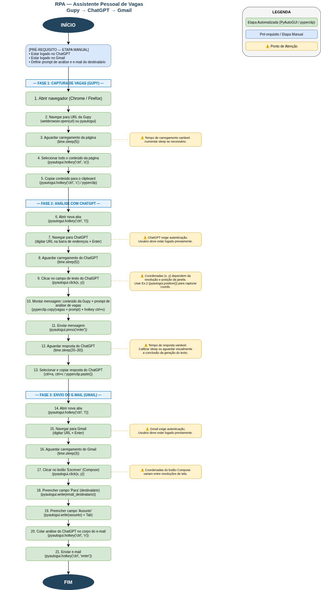

# Module 3 - Week 4 Reports

This directory contains the whiteboard/flowchart deliverable for the Module 3, Week 4 RPA exercises.

## Exercise 1 — Desenho do Fluxo do Processo (Whiteboard)

**Objetivo:** Representar visualmente o processo que será automatizado com PyAutoGUI, identificando etapas manuais, etapas automatizáveis e pontos de atenção.

**Ferramenta utilizada:** [draw.io](https://app.diagrams.net)

**Imagem do diagrama:**



---

## Processo Mapeado — Assistente Pessoal de Vagas

O processo automatiza o seguinte fluxo de ponta a ponta:

| Fase | Descrição |
|------|-----------|
| **Fase 1** | Captura do conteúdo de vagas da plataforma Gupy |
| **Fase 2** | Envio do conteúdo ao ChatGPT para análise e geração de resumo |
| **Fase 3** | Redação e envio de e-mail (Gmail) com a análise gerada |

### Legenda do Diagrama

| Cor | Significado |
|-----|-------------|
| Verde | Etapa automatizada (PyAutoGUI / pyperclip / time) |
| Azul | Pré-requisito ou etapa manual |
| Amarelo | ⚠️ Ponto de atenção |

### Principais Pontos de Atenção

1. **Tempo de carregamento variável** — `time.sleep()` deve ser calibrado conforme velocidade da conexão.
2. **Login no ChatGPT** — o usuário precisa estar autenticado antes da execução.
3. **Coordenadas de tela (x, y)** — dependem da resolução e posição da janela; capturar com `pyautogui.position()` (Ex. 2).
4. **Tempo de resposta do ChatGPT** — variável; o sleep precisa ser generoso ou usar verificação visual.
5. **Login no Gmail** — o usuário precisa estar autenticado antes da execução.
6. **Coordenadas do botão Compose** — variam entre resoluções; capturar com `pyautogui.position()`.

---

## Bibliotecas Utilizadas no Processo

```python
import pyautogui   # automação de mouse e teclado
import pyperclip   # cópia/cola de texto via clipboard
import time        # controle de timing entre ações
import webbrowser  # abertura do navegador (alternativa)
```
